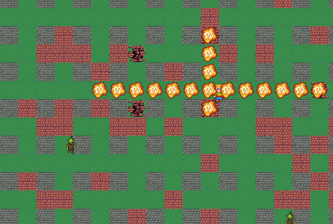

# Samuel TITTELEIN

> S'aimer soi-même  
> est le début d'une histoire d'amour  
> qui durera toute une vie

_- Oscar Wilde -_

---

---

# Formations

- Actuellement, je suis en 2ème année de **BUT Informatique** à l'IUT de Lens.
- J'ai obtenu mon **baccalauréat général** en 2023 au lycée Gambetta Carnot d'Arras, avec les spécialités **Mathématiques**, 🖥️ **NSI** (Numérique et Sciences de l'Informatique) et 🖌️ **Arts Plastiques**.

---

# Activités et Loisirs

- ⛺ Je suis scout au sein des **Scouts et Guides de France** (SGDF) depuis 2016.  
  _Désormais chef scout, j'encadre une vingtaine de jeunes (de 8 à 11 ans) les samedis, et l'été je pars plusieurs semaines en camp._

- 👔 Je suis en cursus **BAFA**. Je suis donc qualifié pour organiser des activités avec des groupes d’enfants.  
  _Je vais bientôt obtenir la qualification pour la direction de camp._

- 🚴 Je suis adhérent à l'Association Droit Au **Vélo** (ADAV).  
  _Le vélo est mon moyen de déplacement privilégié._

- 🤹‍♂️ Je suis licencié de la Fédération Française des Écoles de **Cirque** (FFEC). Je suis également adhérent d'une troupe de cirque.  
  _Je sais jongler avec 5 balles._

- 🌱 Je suis animateur de **La Fresque du Climat**.  
  _Je suis sensible à la cause écologique._

- ⛵ J'ai le niveau 3 de la Fédération Française de **Voile** (FFV).

- 🖌️ J’ai suivi des cours de **dessin** pendant 8 ans.

# Projets

- Reproduction du jeu [Bomberman](https://github.com/samuel-tittelein/samuel-tittelein/Bomberman) en javaFX dans le cadre de ma formation.
